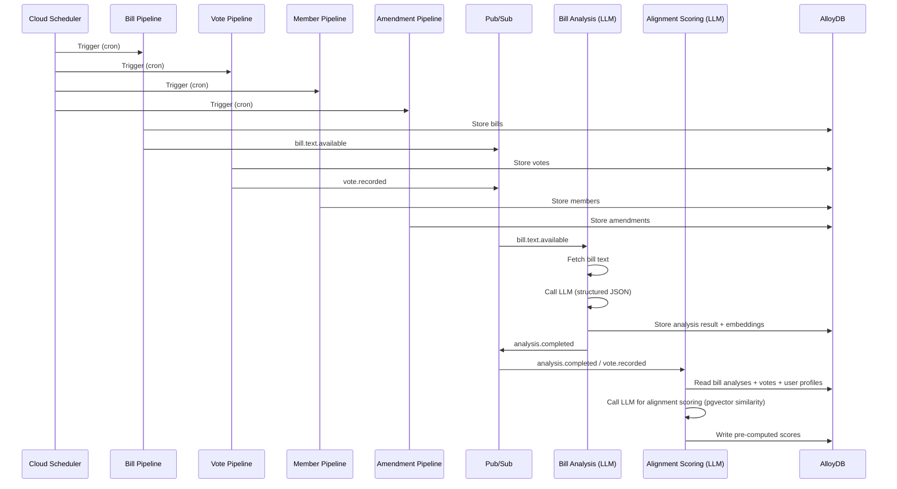

<!-- GENERATED FILE — DO NOT EDIT. Source: docs/architecture/system-design/03-event-flow.md -->

# Event Flow (Pub/Sub)

**Pattern:** Cloud Scheduler triggers four pipelines on schedule. Bill/Vote/Member/Amendment pipelines store data in AlloyDB and publish events to Pub/Sub. Bill Analysis subscribes to `bill.text.available`, fetches text, calls LLM for structured analysis, stores results + embeddings, publishes `analysis.completed`. Alignment Scoring subscribes to `analysis.completed` and `vote.recorded`, reads stored analyses/votes/profiles, calls LLM for similarity-based scoring using pgvector, writes pre-computed scores to DB.